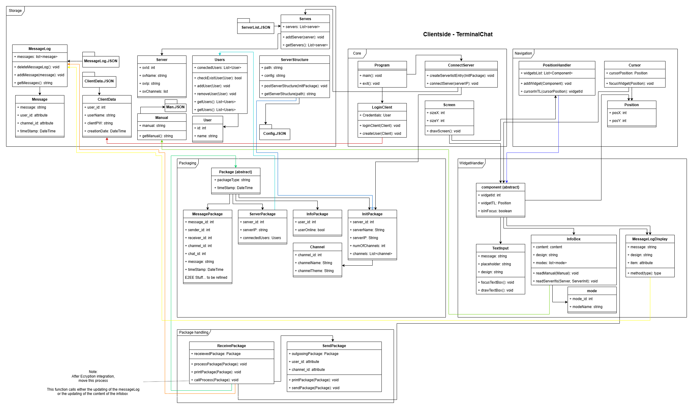
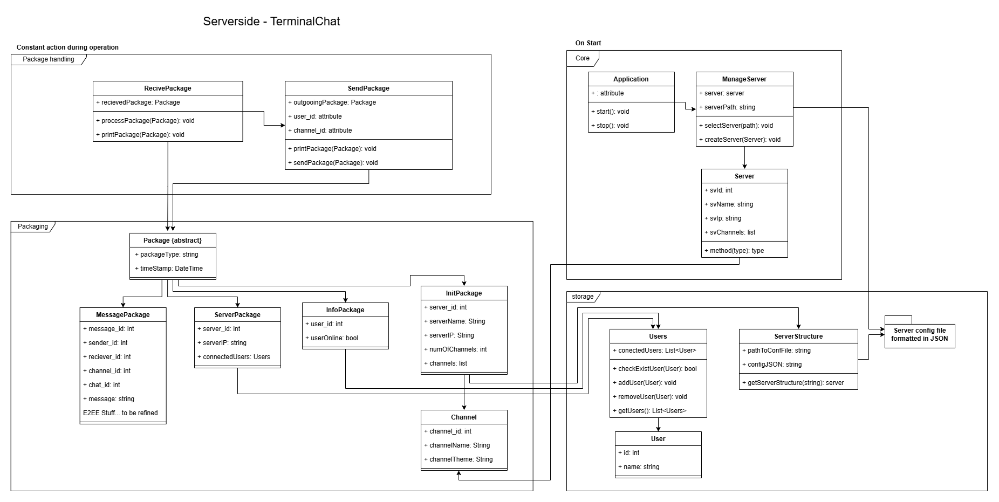

# TerminalChat - Code-Doc

## Content

- [TerminalChat - Code-Doc](#terminalchat---code-doc)
  - [Content](#content)
  - [Concept](#concept)
    - [Architecture](#architecture)
      - [Program structure](#program-structure)
  - [Improvements](#improvements)
    - [Current state - Github Issues](#current-state---github-issues)
  - [Design-ideas](#design-ideas)
  
## Concept

### Architecture

The client-side is structured as seen in the class-diagramm: 



The server-side is structured as seen in the class-diagramm:



#### Program structure

```
TerminalChatV1/    
├── .vs/  
├── TerminalChatServerV1/  
│   ├── Properties/  
│   ├── Program.cs  
│   ├── ServerClasses.cs  
│   ├── ServerDataCrud.cs  
│   ├── ServerTcpConnection.cs  
│   ├── TerminalChatServer.csproj  
│   └── TerminalChatServer.csproj.user  
├── TerminalChatV1/  
│   ├── ClientTcpConnection.cs  
│   ├── DataClasses.cs  
│   ├── FileManager.cs  
│   ├── Program.cs  
│   ├── ReadWriteData.cs  
│   ├── SetupLocalUser.cs  
│   ├── TerminalChatUser.csproj  
│   └── TerminalChatUser.csproj.user  
└── TerminalChat.sln  
```

## Improvements

### Current state - Github Issues

Is done:
- [Most Planning aspects](https://github.com/gbssg/ims.project.terminalchat/issues?q=is%3Aissue%20is%3Aclosed%20label%3Adoc)

Is not done:
- [Userguid, Userinstallation, etc.](https://github.com/gbssg/ims.project.terminalchat/issues?q=is%3Aissue%20is%3Aopen%20label%3Adoc)
- [Client Interface](https://github.com/gbssg/ims.project.terminalchat/issues/24)
  - [Infobox](https://github.com/gbssg/ims.project.terminalchat/issues/69)
  - [Messagebox](https://github.com/gbssg/ims.project.terminalchat/issues/68)
  - [Textbox](https://github.com/gbssg/ims.project.terminalchat/issues/67)
- [Client Controller](https://github.com/gbssg/ims.project.terminalchat/issues/23)

To improve or add:
- Add encryption
- Add voicecall support
- Add support for dotfiles (customization)

## Design-ideas

My defined principle is that the default design should look simple, the user should not be distracted by some fancy design.
The User should be able to customize the application via a design file.
