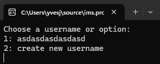
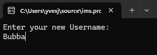

# Client-Doc

## Content

- [Client-Doc](#client-doc)
  - [Content](#content)
  - [Remark](#remark)
  - [Client](#client)
    - [FileManager](#filemanager)
      - [`string directoryPath`](#string-directorypath)
      - [`string setupUserPath`](#string-setupuserpath)
      - [`string serverListPath`](#string-serverlistpath)
      - [`void SetupAppDir() {}`](#void-setupappdir-)
      - [`void CreateServerProfile(Server server) {}`](#void-createserverprofileserver-server-)
      - [`string GetServerProfilePath(Guid serverUUID) {}`](#string-getserverprofilepathguid-serveruuid-)
      - [`string GetMessageLogPath(Guid serverUUID) {}`](#string-getmessagelogpathguid-serveruuid-)
    - [ReadWriteData](#readwritedata)
      - [`Filemanager fm`](#filemanager-fm)
      - [`void UpdateServerlist(Server server) {}`](#void-updateserverlistserver-server-)
      - [`Serverlist ReadServerList() {}`](#serverlist-readserverlist-)
      - [`void UpdateServerProfile(Server server) {}`](#void-updateserverprofileserver-server-)
      - [`Server ReadServerProfile(Guid serverUUID) {}`](#server-readserverprofileguid-serveruuid-)
      - [`void UpdateSetupUserlist(SetupUser _setupUser) {}`](#void-updatesetupuserlistsetupuser-_setupuser-)
      - [`SetupUserList ReadSetupUserlist() {}`](#setupuserlist-readsetupuserlist-)
      - [`MessageLog ReadMessageLog(Guid serverUUID) {}`](#messagelog-readmessagelogguid-serveruuid-)
      - [`void UpdateMessagelog(Message _message) {}`](#void-updatemessagelogmessage-_message-)
    - [Setup](#setup)
      - [`ReadWriteData readWriteData`](#readwritedata-readwritedata)
      - [`public void UserSetupPrompt() {}`](#public-void-usersetupprompt-)
      - [`public void CreateSetupUser() {}`](#public-void-createsetupuser-)
    - [Dataclasses](#dataclasses)
      - [Message: `ToJson()`](#message-tojson)
      - [`function name (parameters) -> return `](#function-name-parameters---return-)
    - [CLI-Controller](#cli-controller)
  - [Server](#server)
    - [Setup](#setup-1)
    - [SV-Controller](#sv-controller)

-----
## Remark
Some of the features that are discussed in the usage of 
functions aren't implemented yet, they're written in future tense.

## Client
### FileManager
---

#### `string directoryPath`

**Description:**

The path to the App-directory using `Path.Combine();`, `Environment.GetFolderPath()`, `Environment.SpecialFolder.ApplicationData` and adds TerminalChatCLI at the end.

#### `string setupUserPath`

**Description:**  

The path to the setupuserlist using `Path.Combine();`, `Environment.GetFolderPath()`, `Environment.SpecialFolder.ApplicationData` and adds TerminalChatCLI and `user.json` at the end.

#### `string serverListPath`

**Description:**  

The path to the serverlist using `Path.Combine();`, `Environment.GetFolderPath()`, `Environment.SpecialFolder.ApplicationData` and adds TerminalChatCLI and `serverlist.json` at the end.

#### `void SetupAppDir() {}`

**Description:**  

Parameter and returnless function that checks if the [Appdirectory](#filemanager-directorypath), [setupuserlist.json](#filemanager-serverlistpath) and [serverlist.json](#filemanager-serverlistpath) exists, if not they will be created.

**Usage:**  
This function is used to generate the AppData file and folder structure, and is run on the start of the programm.

#### `void CreateServerProfile(Server server) {}`

**Description:**  
A returnless function that creates an empty serverprofile folder with the nessesary files contained (`serverprofile.josn`, `messagelog.json`), the directory is named after the parameters UUID of the Server so there are no duplicates.

**Parameters:**    
| Name   | Type   | Description                                             |
| ------ | ------ | ------------------------------------------------------- |
| server | Server | The Server class is described in [Dataclasses/Server]() |

**Usage:**  
Everytime a new serverprofile is created aka. every time the user connects to a new server and gets sent the serverprofile, a new serverprofile gets created if there isn't one already. This function gets called when theres a serverprofile missing. 

#### `string GetServerProfilePath(Guid serverUUID) {}`

**Description:**  
This function returns the path of the specefied server by the UUID in the parameter, It crafts the path with the serverUUID according to the determined pattern and searches for it and returns it if it was found.

**Parameters:**    
| Name       | Type | Description                                               |
| ---------- | ---- | --------------------------------------------------------- |
| serverUUID | Guid | The Id of the serverprofle which path has been requested. |

**Returns:**  
| Type   | Description                    |
| ------ | ------------------------------ |
| string | ther Path to the serverprofile |
| string | "file not found"               |

**Usage:**  
The function is used in the CRUD functions to recieve the paths to write and read from specified files.

#### `string GetMessageLogPath(Guid serverUUID) {}`

**Description:**  
This function returns the path of the messagelog of the specefied server by the UUID in the parameter, It crafts the path with the serverUUID according to the determined pattern and searches for it and returns it if it was found.

**Parameters:**    
| Name       | Type | Description                                               |
| ---------- | ---- | --------------------------------------------------------- |
| serverUUID | Guid | The Id of the serverprofle which path has been requested. |

**Returns:**  
| Type   | Description                 |
| ------ | --------------------------- |
| string | ther Path to the messagelog |
| string | "file not found"            |

**Usage:**  
The function is used in the CRUD functions to recieve the paths to write and read from specified files.

### ReadWriteData

#### `Filemanager fm`

**Description:**  
An instance of the Filemanager, `fm` to use the pathvariables and functions in tne readeWriteData class.

#### `void UpdateServerlist(Server server) {}`

**Descritpion:**  
This is a returnless function which adds or updates a server in the serverlist, it identifys the different servers by the UUID and overrides to update or adds to the list if theres nothing to override.

**Parameters:**    
| Name   | Type   | Description                                                                                 |
| ------ | ------ | ------------------------------------------------------------------------------------------- |
| server | Server | an instance of a server containing all vital information about an external server instance. |

**Usage:**  
This function is used to add or alter a serverprofile in the serverlist, attention it does not alter nor create any serverprofiles or write data into them. It exists merely to update the serverlist.

#### `Serverlist ReadServerList() {}`

**Description:**  
This parameterless function reads and deserializes the locally saved serverlist by calling the filemanager `fm` class variable `serverlistPath`, and outputs it as a `ServerList` object.

**Returns:**  
| Name       | Type       | Description                  |
| ---------- | ---------- | ---------------------------- |
| serverList | ServerList | Returns a Serverlist object. |

**Usage:**  
This function is mainly used by the `void UpdateServerlist(Server server) {}` but will also used to display saved serverprofiles in the TUI/CLI.

#### `void UpdateServerProfile(Server server) {}`

**Description:**  
This returnless function overrides the serverprofile by the UUID, uses the filemanagers `fm` `.GetServerProfilePath(serverUUID)`  to get the file path to override the json.

**Parameters:**    
| Name   | Type   | Description                                                                                 |
| ------ | ------ | ------------------------------------------------------------------------------------------- |
| server | Server | an instance of a server containing all vital information about an external server instance. |

**Usage:**   
This function is used to write serverprofiles by the UUID. 

#### `Server ReadServerProfile(Guid serverUUID) {}`

**Description:**  
This function is used to deserialize and read the locally saved serverprofile by UUID, and returns the Server object. 

**Parameters:**    
| Name       | Type | Description                                          |
| ---------- | ---- | ---------------------------------------------------- |
| serverUUID | Guid | The Id of the serverprofle which has been requested. |

**Returns:**  
| Name   | Type   | Description                             |
| ------ | ------ | --------------------------------------- |
| server | Server | Returns by UUID selected server object. |

**Usage:**  
This function will be used by the display process to visualize the internal structure of the server (mainly channels), to be displayed in the TUI/CLI. 

#### `void UpdateSetupUserlist(SetupUser _setupUser) {}`

**Description:**  
This function uses the [`readSetupUserlist()`](#setupuserlist-readsetupuserlist-) to acess existing setupusers so they can be updated/repalced or added if they do not already exist.

**Parameters:**    
| Name        | Type          | Description                                              |
| ----------- | ------------- | -------------------------------------------------------- |
| \_setupUser | SetupUserList | The setupUser object to be added or updated in the list. |

**Usage:**  
This function will be used after the user selected their alias to save/update the SetupUserList.

#### `SetupUserList ReadSetupUserlist() {}`

**Description:**  
This parameterles function reads the setupuserlist by using the filemanager variable [`setupUserPath`](#string-setupuserpath) and deserializes the json into an object and returns that object.

**Returns:**  
| Name  | Type          | Description                                      |
| ----- | ------------- | ------------------------------------------------ |
| users | SetupUserList | Returns the SetupUserList that is saved Locally. |

**Usage:**  
This function will be used to choose from a already existing users aka aliases to ose on servers on programm startup.

#### `MessageLog ReadMessageLog(Guid serverUUID) {}`

**Description:**  
This function uses the UUID given in the parameter to get the Path to the messsagelog and deserializes the json into a messagelog object and returns the messagelog object.  

**Parameters:**    
| Name       | Type | Description                                       |
| ---------- | ---- | ------------------------------------------------- |
| serverUUID | Guid | The servers UUID corresponding to the messagelog. |

**Returns:**  
| Name       | Type       | Description                                                  |
| ---------- | ---------- | ------------------------------------------------------------ |
| messageLog | MessageLog | Returns the MessageLog corresponding to the parameters UUID. |

**Usage:**  
This function will be used to read out the various messages tho then be sorted by channelID and then be displayed on the TUI depending on which channel is selected.

#### `void UpdateMessagelog(Message _message) {}`

**Description:**  
This function adds the message specified in the parameter into the respective messagelog by the UUID specified in the message object, it uses `ReadMessageLog()` to access the "messagesList" to then add the message into it and serialize it back into a json text which sis then written into the messageLog.json whereas for the path the filemanagers `GetMessageLogPath(Guid serverUUID)` was used.

**Returns:**
| Name | Type | Description |
| ---- | ---- | ----------- |
| N/A  | N/A  | N/A         |

**Usage:**
This function is used to add messages to the messagelog, this will be used in the process of recieving messages and storeing them into the local files.

### Setup

#### `ReadWriteData readWriteData`

**Description:**  
An instance of the [`ReadWriteData`](#readwritedata) Class to use the [`UpdateUserList()`](#void-updatesetupuserlistsetupuser-_setupuser-) to write the newly selected user into the local storage.

#### `public void UserSetupPrompt() {}`

**Description:**  
This void function prompts the user on startup which alias thy want to use for the current session, the options are to use the most recent username or to create a new user.

**Usage:**  
This is only once used on stardup to get the users alias/username, to further use it to sign messages and user activity on servers.

#### `public void CreateSetupUser() {}`

**Description:**  
This function is called by [`UserSetupPrompt()`](#public-void-usersetupprompt-) and prompts the user to enter a new username, the username cant be shorter then zero and longer then 32 characters.

**Usage:**  
This function manages the prompt and the input resulting from the prompt. The entered name gets processed by [ReadWriteData.UpdateSetupUserList()](#void-updatesetupuserlistsetupuser-_setupuser-).s

### Dataclasses
---
#### Message: `ToJson()` 
This is true for the `Message`, `Server` and `ServerList` classes
**Description:**    
Parameter less funtion to Serialize the message object into a formatted Json String.

**Parameters:**  
| Name | Type | Description |
| ---- | ---- | ----------- |
| N/A  | N/A  | N/A         |

**Returns:**  
| Type   | Description                               |
| ------ | ----------------------------------------- |
| string | returns object as a formatted Json string |

**Usage:**  
This function is used by the storage management to get the json string to save the data into files.

---
#### `function name (parameters) -> return `  
**Description:**  
>  

**Parameters:**  
| Name | Type | Description |
| ---- | ---- | ----------- |

**Returns:**  
| Type | Description |
| ---- | ----------- |

**Exeptions/Errors:**  
>  

**Usage:**
>  

### CLI-Controller
---

## Server
### Setup
---
### SV-Controller

